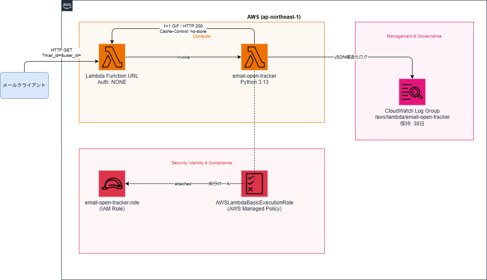

# aws-email-open-tracking-poc

Lambda Function URL をトラッキングピクセルのエンドポイントとして使い、メール開封イベントを CloudWatch Logs に記録する PoC です。

AWS SES の Open Tracking 機能は使わず、Lambda を直接エンドポイントにすることで仕組みをゼロから理解することが目的です。

## アーキテクチャ



| リソース | Terraform リソース名 | 用途 |
| --- | --- | --- |
| Lambda Function | `aws_lambda_function.tracker` | トラッキングピクセルのリクエスト受信・ログ出力（ランタイム: Python 3.13） |
| Lambda Function URL | `aws_lambda_function_url.tracker` | 外部公開の HTTP エンドポイント（Auth: NONE） |
| Lambda Permission | `aws_lambda_permission.allow_public_url` | Function URL からの公開アクセスを許可 |
| Lambda Permission | `aws_lambda_permission.allow_public_invoke` | 直接 Invoke の公開アクセスを許可 |
| CloudWatch Log Group | `aws_cloudwatch_log_group.tracker` | 開封イベントの JSON ログ保存（保持: 7日、変数で変更可） |
| IAM Role | `aws_iam_role.tracker` | Lambda 実行ロール |
| IAM Policy Attachment | `aws_iam_role_policy_attachment.basic_execution` | AWSLambdaBasicExecutionRole のアタッチ |

## 構成

```text
.
├── terraform/
│   ├── main.tf              # AWS プロバイダー設定
│   ├── variables.tf         # 変数定義（リージョン、関数名、ログ保持日数）
│   ├── outputs.tf           # Function URL 等の出力
│   ├── lambda.tf            # Lambda + Function URL + Lambda Permission + CloudWatch Log Group
│   ├── iam.tf               # IAM 実行ロール
│   └── src/
│       └── lambda_function.py
└── scripts/
    └── send_test_email.py   # SMTP 経由でトラッキングピクセル入りメールを送信
```

## デプロイ手順

### 前提条件

- [Terraform](https://developer.hashicorp.com/terraform/install) >= 1.10
- AWS 認証情報（環境変数または aws-vault）

### 通常パターン（環境変数で認証）

```bash
export AWS_ACCESS_KEY_ID=your-access-key
export AWS_SECRET_ACCESS_KEY=your-secret-key
export AWS_DEFAULT_REGION=ap-northeast-1

cd terraform
terraform init
terraform plan
terraform apply
```

### aws-vault パターン

```bash
cd terraform

# 初回のみ
terraform init

# プロファイル名を指定して plan / apply
aws-vault exec <profile> -- terraform plan
aws-vault exec <profile> -- terraform apply
```

### Function URL の確認

```bash
terraform output lambda_function_url
# 例: https://xxxxx.lambda-url.ap-northeast-1.on.aws/
```

## 検証手順

### トラッキングピクセルの仕組み

HTML メールに 1×1px の透明画像を `` タグで埋め込みます。メールクライアントがメールを描画する際にその URL へ HTTP GET リクエストを送るため、Lambda にリクエストが届きます。

```text
メール開封
  └─ -> メールクライアントが  の URL へ HTTP GET
        └─ -> Lambda 起動 -> CloudWatch Logs にイベント記録
```

**クエリパラメータでメール・受信者を識別します:**

```text
https://xxxxx.lambda-url.ap-northeast-1.on.aws/?mail_id=msg-001&user_id=usr-001
```

| パラメータ | 役割 | 例 |
| --- | --- | --- |
| `mail_id` | どのメールかを識別 | `newsletter-2026-06`, `campaign-a` |
| `user_id` | 誰に送ったかを識別 | `user-001`, `tanaka` |

---

### ステップ 1: URL を作成する

`terraform output lambda_function_url` で取得した URL の末尾にクエリパラメータを付けます。

```text
https://xxxxx.lambda-url.ap-northeast-1.on.aws/?mail_id=test-001&user_id=user-001
```

---

### ステップ 2: メールにピクセルを埋め込んで送信する

#### Python スクリプトで送信する

標準ライブラリのみで動作します。追加パッケージのインストールは不要です。  
`--smtp-host` / `--smtp-port` で任意の SMTP サーバーに対応できます。

##### 環境変数に認証情報をセット

```bash
export SMTP_USER=you@example.com      # 送信元メールアドレス
export SMTP_PASSWORD="your-password"  # SMTP パスワード
```

##### スクリプトを実行

**Gmail の場合** （デフォルト設定のまま使用可能）

Gmail は通常パスワードでの SMTP ログインを許可していません。事前に 2 段階認証を有効にし、[アプリパスワード](https://myaccount.google.com/apppasswords) を発行して `SMTP_PASSWORD` に設定してください。

```bash
python scripts/send_test_email.py \
  --to recipient@example.com \
  --tracking-url https://xxxxx.lambda-url.ap-northeast-1.on.aws/
```

###### Xserver など任意の SMTP の場合

サーバーパネルで確認した SMTP ホスト名を `--smtp-host` に指定します。

```bash
python scripts/send_test_email.py \
  --to recipient@example.com \
  --tracking-url https://xxxxx.lambda-url.ap-northeast-1.on.aws/ \
  --smtp-host sv****.xserver.jp \
  --smtp-port 465
```

`--verbose` を付けると送信前に生成された HTML を標準出力に表示できます。

実行後、以下のように表示されれば送信成功です。

```text
接続中: sv****.xserver.jp:465 ...
送信完了 → recipient@example.com
トラッキングURL: https://xxxxx.lambda-url.ap-northeast-1.on.aws/?mail_id=test-001&user_id=user-001
```

受信したメールを開封すると Lambda が起動し、ログが記録されます。

> **注意 1:** Gmail は画像を Google のプロキシ経由で取得するため、`source_ip` はユーザーの実 IP ではなく Google のサーバー IP になります。
>
> **注意 2（外部画像の遮断）:** メールクライアントやメールサーバーが外部画像を自動的にブロックする場合があります。その場合、メールを開封しても Lambda にリクエストが届かずログは記録されません。検証時は以下を確認してください。
>
> | 環境 | 確認・対処 |
> | --- | --- |
> | **Gmail（Web）** | 受信メール上部に「画像が表示されていません」バナーが出る場合は「画像を表示」をクリック |
> | **Xserver WebMail** | セキュリティ設定で外部画像の読み込みが無効になっている場合は、設定を一時的に許可する |
> | **Outlook / Apple Mail** | メールクライアントの「画像を自動的にダウンロードする」設定を有効にする |
> | **メールサーバー側のフィルター** | 送受信サーバーが img タグを除去している場合は、送信先を別プロバイダー（Gmail など）に変えて動作確認する |

---

### ステップ 3: CloudWatch Logs Insights で確認する

AWS コンソール → **CloudWatch → Logs Insights** を開き、ロググループ `/aws/lambda/email-open-tracker` を選択して以下を実行します。

```sql
fields @timestamp, query.mail_id, query.user_id, user_agent, source_ip
| sort @timestamp desc
| limit 20
```

以下のようなログが記録されていれば成功です。

```json
{
  "event_type": "mail_open",
  "query": { "mail_id": "test-001", "user_id": "user-001" },
  "user_agent": "Mozilla/5.0 ...",
  "source_ip": "66.249.xx.xx"
}
```

## 削除

```bash
# 通常パターン
cd terraform
terraform destroy

# aws-vault パターン
aws-vault exec <profile> -- terraform destroy
```
